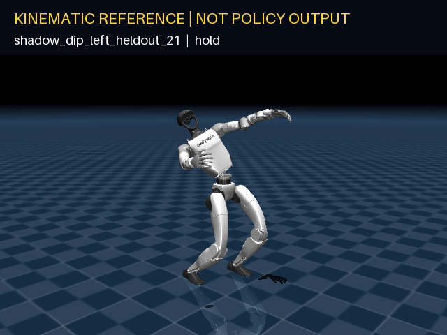

# Shadow Dance — SuperSONIC Trial 03

**Team SELTZER · Performance Arts · Unitree G1**

Shadow Dance is teaching SONIC a five-second **Shadow Partner Dip**: establish an
absent-partner dance frame, step back and pivot, descend into an unsupported off-axis
dip, hold for a readable beat, and recover without hand or floor support.

The move is a testable hypothesis until the stock checkpoint comparison is complete.
This repository never substitutes the kinematic reference for policy output and never
fills result tables with estimates.



*Kinematic target only—not stock or fine-tuned policy output.*

> Current state (2026-08-16): the original synthetic references and fail-closed
> reproducible pipeline pass local validation and public Linux regeneration. The
> immutable [Shadow Dip v1.0.0 reference release](https://github.com/cristpierce/shadow-dance/releases/tag/shadow-dip-v1.0.0)
> is public. Stock/fine-tuned metrics, final ONNX links, and the policy before/after
> video remain pending authorized compute access.
> See [PROGRESS.md](PROGRESS.md).
> The exact Nebius execution and publication handoff is in
> [docs/cloud-runbook.md](docs/cloud-runbook.md).

## Why this is a meaningful new skill

SONIC already has broad dance data, so the claim is not “the robot learned to dance.”
The proposed novelty is the complete partnerless sequence: a recognizable asymmetric
arm frame, a planted back-step, lateral and backward load transfer, a sustained
approximately 30-degree waist-envelope pose, and controlled recovery. The hard novelty
gate is behavioral: stock SONIC must fail or materially under-track the frozen
validation family while the adapted policy succeeds. Checkpoint selection then freezes
before either policy is measured on the independent final-test family.

## Evidence dashboard

| Gate | Artifact | State |
|---|---|---|
| Original data + provenance | [`shadow-dip-v1.0.0`](https://github.com/cristpierce/shadow-dance/releases/tag/shadow-dip-v1.0.0) manifest, PKLs, and source CSVs | 30 sequences generated, hashed, and public |
| G1 limits / foot IK / support QA | `results/reference-validation.json` | 30/30 pass; 0 warnings |
| Stock SONIC on validation moves | raw eval log + novelty report | Pending Isaac run |
| Fine-tuned SONIC | deadline-planned 5/500/4,000 checkpoint ladder from pinned base | Pending Isaac run |
| Fundamentals retention | identical stock/fine-tuned suite | Pending Isaac run |
| Untouched final test | 4 motions × 3 seeds per policy, bound to frozen selection | Pending checkpoint selection |
| Deployable policy | checked ONNX graphs + hashes | Pending selected checkpoint |
| Judge-facing comparison | locked-camera stock/fine-tuned video | Pending both policy renders |

## Dataset design

The dataset is team-authored and procedural. It does **not** contain BONES-SEED motion
or third-party dance video. Keyframes define the artistic pose; numerical inverse
kinematics solves each leg against the pinned NVIDIA G1 MJCF so planted feet stay
planted. The generator produces:

- 12 training dip variants across direction, depth, timing, hold, and step geometry;
- 10 conservative stand/squat/sway/torso-turn/forward-walk/heading-turn rehearsal motions;
- 4 separately parameterized validation dips used for checkpoint selection;
- 4 independently parameterized final-test dips opened only after selection; and
- both transparent degree/centimetre CSV and SONIC motion-lib PKL forms.

The locomotion references are measurable rather than label-only: the two walks move the
root forward 16.4–17.2 cm, and the two heading turns finish 20.6–22.6° from the starting
heading. They are a transparent local retention proxy; no official WBT-Bench score is
claimed until the organizer's evaluator is actually run.

Validation and final-test variants are never placed in the training directory. Final
test is excluded from every training, novelty, early-stopping, and checkpoint-selection
decision. Dataset details and limitations are in
[docs/dataset-card.md](docs/dataset-card.md).

## Reproduce locally

Prerequisites: Python 3.11+, Git, and a checkout of NVIDIA's upstream repository at
commit `c374bae5b9039cd0ee71377e654d11ce1bc69e1d` next to this repository.

```powershell
py -3.13 -m venv .venv
.venv\Scripts\python -m pip install -e ".[dev,onnx,publish]"
$env:SONIC_ROOT = "C:\path\to\GR00T-WholeBodyControl"

.venv\Scripts\shadow-generate --sonic-root $env:SONIC_ROOT
.venv\Scripts\shadow-validate --sonic-root $env:SONIC_ROOT
.venv\Scripts\pytest -q
```

Render a labelled *reference-only* preview:

```powershell
.venv\Scripts\shadow-render `
  data/generated/heldout/shadow_dip_left_heldout_21.pkl `
  --sonic-root $env:SONIC_ROOT `
  --manifest data/manifests/shadow-dip-v1.json `
  --output media/reference-kinematic.mp4
```

The small frozen PKLs, source CSVs, manifest, validator report, code, hashes, and clearly
watermarked reference preview are committed so the cloud job needs no hidden local
input. Policy renders remain ignored until they are packaged with their run evidence.
The exact frozen bundle is also available in the public
[GitHub reference release](https://github.com/cristpierce/shadow-dance/releases/tag/shadow-dip-v1.0.0),
whose archive SHA-256 is
`94099f031b8a0b5ea36c809e705f77088342a6b54d73f9735508b146841c1370`.
It will be mirrored to a versioned Hugging Face dataset after entrant authentication.

### Frozen reference QA

These are measured from `results/reference-validation.json`, not policy results:

| Check | Worst case across 30 sequences |
|---|---:|
| Foot IK position / orientation residual | 6.66 mm / 3.57° |
| Joint-limit violation | 0 rad |
| Peak pelvis drop / waist roll | 0.147 m / 0.490 rad (28.1°) |
| Peak joint speed vs Isaac limit | 15.9% |
| Peak joint acceleration | 54.71 rad/s² |
| Floor penetration | 4.24 mm |
| Planted-foot horizontal speed, p95 | 0.0556 m/s |
| Two-foot support margin | +0.053 m minimum |
| Deep-hold support margin | +0.072 m minimum |
| Dynamic single-support margin | −0.029 m minimum |
| MuJoCo self contacts | 0 |

The peak planted-foot-speed value comes from the owned forward-walk rehearsal. The
negative instantaneous margin occurs during a moving-foot interval and is why the
policy baseline remains a mandatory go/no-go gate; the hero's planted deepest hold has
a positive 7.24 cm quasi-static margin.

## Train, compare, and export

Isaac Lab uses the official `sonic_release` architecture and checkpoint. The custom
motions exercise the G1 and derived teleoperation references; `smpl_motion_file=dummy`
is supported by upstream and prevents fake SMPL data from entering the provenance
chain.

```bash
# 5-iteration data/environment smoke
SONIC_ROOT=/workspace/GR00T-WholeBodyControl \
NUM_ENVS=64 ITERATIONS=5 RUN_NAME=shadow_dip_smoke \
bash scripts/train.sh

# Identical frozen validation references for stock and a candidate checkpoint
MOTION_KEYS_FILE=data/splits/heldout.txt NUM_ENVS=4 SEED=42 \
  bash scripts/evaluate.sh /workspace/sonic_release/last.pt stock data/generated/heldout
MOTION_KEYS_FILE=data/splits/heldout.txt NUM_ENVS=4 SEED=42 \
  bash scripts/evaluate.sh /workspace/outputs/.../last.pt stage-4000 data/generated/heldout

# Locked-camera policy output and ONNX export
MOTION_KEYS_FILE=data/splits/test.txt NUM_ENVS=4 SEED=303 \
  bash scripts/render_policy.sh /workspace/sonic_release/last.pt stock data/generated/test
MOTION_KEYS_FILE=data/splits/test.txt NUM_ENVS=4 SEED=303 \
  bash scripts/render_policy.sh /workspace/outputs/.../last.pt selected data/generated/test
bash scripts/export_onnx.sh /workspace/outputs/.../last.pt data/generated/test
python scripts/verify_artifacts.py /workspace/outputs/.../exported
```

The checkpoint ladder is bounded by the 10-hour cloud wall-time guard and the absolute
submission deadline. It freezes the largest ordered prefix that still leaves two hours
for final evidence and 45 minutes for portal submission, records any omitted/timed-out
stage, and stops if no completed candidate clears the preregistered novelty,
improvement, and retention gates. It is not an instruction to burn the full credit
allocation. Exact parameters and the selection rule are in
[configs/shadow_dip_finetune.yaml](configs/shadow_dip_finetune.yaml).

## Result contract

The final headline will be populated only from frozen evaluation artifacts:

> Across 12 untouched final-test trials (4 motions × 3 simulator seeds), stock SONIC completed `[x/12]`
> trials and the selected fine-tuned checkpoint completed `[y/12]`; local MPJPE changed
> from `[a]` to `[b]` mm while the 10-motion fundamentals-retention score changed by
> `[z]` points.

Reference playback proves the target is kinematically coherent. It is not evidence that
the policy can execute it. “Before” and “after” will always mean stock-policy and
fine-tuned-policy simulation output, respectively.

## Repository map

```text
src/shadow_dance/       generator, MuJoCo IK, validator, renderer
data/                   provenance manifest, splits, dataset notes
configs/                frozen experiment intent and checkpoint ladder
scripts/                train, eval, render, export, artifact checks
results/                raw/derived evaluation contract
submission/             portal-ready copy and completion checklist
docs/research/          dated challenge and strategy research
docs/cloud-runbook.md   exact no-compute plan, launch, recovery, and publication handoff
```

## Safety, licensing, and limits

- Designed for Unitree G1 and validated in simulation; no real-robot claim is made.
- A real robot must use vendor safety limits, an operator stop, and a clear fall zone.
- Project code and generated motion are Apache-2.0. NVIDIA source/model terms remain in
  force; see [NOTICE](NOTICE).
- The final policy is a derivative of NVIDIA's SONIC checkpoint under the NVIDIA Open
  Model License and will ship with required attribution.
- No BONES-SEED raw or derived motion is used in `shadow-dip-v1`.

## Team

Team **SELTZER** (two members). Repository implementation and submission coordination:
Pierce Crist (`cristpierce`) and Myles Shetty (`Durp06`). The portal currently exposes
only the teammate initial in the supplied screenshot, so both display names must still
be checked exactly as registered before submission.

## Challenge acknowledgement

**Motion Data by Bones Studio.** This acknowledgement is included as requested by the
Ultimate Bots portal. Shadow Dance's published trajectories are independently
team-authored; no BONES-SEED motion or derived data is included.
